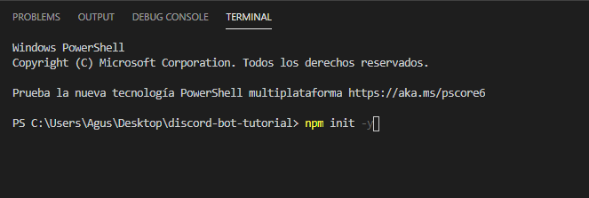
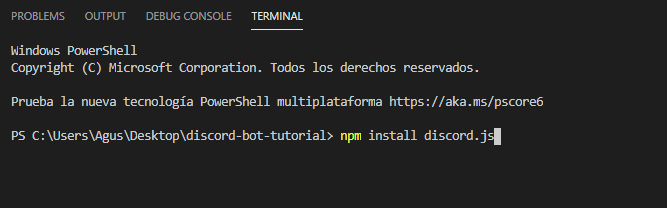
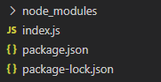
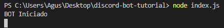
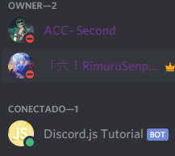
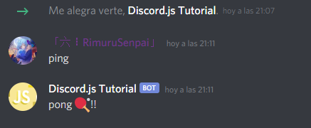

Discord.js es una biblioteca que facilita la interacción con la API de Discord. En comparación con la mayoría de las otras bibliotecas de Discord, utiliza un enfoque más orientado a objetos para que el código de su bot sea más limpio y más fácil de entender.

# A tener en Cuenta

Estás a punto de ver el script del lenguaje de programación JavaScript JS. 

Para desarrollar un bot con discord.js, debes tener un conocimiento bastante bueno de JavaScript, ya que si no tenemos conocimiento solo nos complicaremos y nos perderemos en esta guia. 
Si tienes alguna dificultad puedes entrar a nuestro servidor de Discord.

# No hagas C&P
Se recomienda escribir el código a mano mientras sigues esta guía (sin copiar y pegar). Esto te ayudará a desarrollar una memoria muscular y un entendimiento de lo que estás agregando mucho más sólido.


# Editor de codigo
Un buen editor de código nos ayudará a simplificar y mejorar su código legible, nos dirá donde están los errores, validar y en algunos ejecutar su código por usted.

Para las guias y ejemplos vamos a utilizar el editor Visual Studio Code (VSC), es un editor de código fuente muy ligero y potente que soportar diferentes lenguajes de programación como: (.JS, C ++, C #, Python, PHP, Go) y runtimes (como .NET y Unity), adaptable para Windows, macOS y Linux, muy recomendado.

# Instalar VSC

Siga estos pasos:
- Ingrese a la pagina web de [VSC](https://code.visualstudio.com/download "VSC")
- Descargar la versión que se adapte a su PC.


- Una vez descargado, ejecute el instalador (VSCodeSetup-version).exe, esto solo tomará unos minutos, dependiendo de sus computadoras.

# Otros editores de codigo
- [Notepad++](https://notepad-plus-plus.org/downloads/ "Notepad++")
- [Brackets](http://brackets.io "Brackets")
- [Sublime Text 3](https://www.sublimetext.com/3 "Sublime Text 3")
- [Atom](https://atom.io "Atom")


El primer paso para crear un primer BOT es crear una aplicación Discord. El bot utilizará la API de Discord, que requiere la creación de una cuenta Discord para propósitos de autenticación. No te preocupes, es súper simple.

Para crear la aplicación, diríjase a la página de [Discord Developer Portal](https://discord.com/developers/applications "Discord Developer Portal")  e inicie sesión, llegará a una página que se vera así:


Haga clic en `New Application` Esto lo llevará a la siguiente página, donde debe ingresar un nombre para la aplicación y un avatar/icon (el nombre de la aplicacion sera para el bot inicial). La descripción para la aplicación es opcional.


Para guardar todos datos ingresados, clic en en el botón `Save Changes` en la parte de abajo.


# Crear usuario BOT
Después de crear la aplicación Discord, ir a la opción `Bot`, y hacer clic en `Add Bot`.


Luego damos clic en `Yes, Do it!`.


Usted a completado el proceso de crear la aplicación y su bot discord, darle clic en `Public Bot`.


Si esto es así, haga clic en `Save Changes` para guardar la configuración y cambios realizados.

### Obtener token de su BOT
> ATENCIÓN: Esta parte es realmente importante, el token de su bot está destinado a ser SECRETO. Es la forma en que Discord autentica su bot, así como cuando inicias sesión con un nombre de usuario y una contraseña. Revelar su token es como poner su contraseña en público, si su token llega a ser pública y usado por otros, genere uno nuevo de inmediato.

El token es secreto, como lo acabo de mencionar, es la forma en que su bot se autentica a Discord.

Para obtener su token, debe ir a la opción de `Bot`, y hacer clic en `Reveal Token`.


A continuación, se visualizará el `Token Secreto` de su BOT.


# Agregar su BOT a un servidor
Bien, incluso si no ha escrito ni una sola línea de código para su bot, ya puede invitarlo a un servidor.

Para invitar a su bot, necesita tener los permisos de `ADMINISTRADOR` en el servidor a donde agregará el bot o ser el creador del mismo. De esa forma podrá agregar o invitar su bot a un servidor.

Copiar el ID de su bot, en la página de la aplicación.


Para generar el link de invitación de su bot utilizaremos una herramienta API de permisos, diríjase a esta página de [Discord Permissons Calculator](https://discordapi.com/permissions.html#8 "Discord Permissons Calculator") para generar el link de invitación.

Pegar el ID del bot en `CLIENT ID` de la siguiente forma.


Abrir el link de invitación generado, se muestra una ventana que le permite elegir el servidor donde podrá agregar su bot, simplemente seleccione el servidor y haga clic en `Autorizar`.


Para usar discord.js y empezar a programar necesitará un par de cosas instaladas. Por lo menos:

- Mínimo: `node.js` versión 10 o superior.
- Tener un editor de código real. Si no tienen instalado un editor de código ir a la Instalación editor de código

# Instalacion de Nodejs
Node es un entorno de ejecución para JavaScript, usa un modelo de operaciones E/S sin bloqueo y orientado a eventos, que lo hace liviano y eficiente.

Para instalar Node, vamos a la siguiente página web [Nodejs.org](https://nodejs.org/es/)


Descargar la versión recomendada e instalar en su PC. (Reinicié su PC si es necesario)

# Preparando el entorno de desarrollo para el BOT

Una vez que tenga el software requerido, el siguiente paso es preparar un espacio para empezar a programar.

- Crear una carpeta en el escritorio o en una unidad de disco duro o partición.
- Darle un nombre a la carpeta (Ej. BOT, BotDiscord, discord-bot-tutorial, etc.).
- Una vez que haya creado una carpeta, abrir la consola (en este caso la consola de VSC).


# Instalacion de discord.js

Una vez dentro de la consola, vamos a instalar discord.js.

Pero primero vamos a inicializar esta carpeta con node y npm (NPM = Node Package Manager - Administrador de paquetes/librerias para node), esto asegurará que cualquier otro módulo instalado se instale dentro de la carpeta creada.

Para iniciar escribimos dentro de la consola, npm init -y , luego pulse enter dentro de la consola.



Se creara un nuevo archivo llamado package.json, esto significa que has iniciado correctamente. Si desea saber más información sobre package.json, haga [clic aquí](https://docs.npmjs.com/files/package.json).

### Ahora instalamos Discord.js a través de npm:

Escribir `npm install discord.js` en la consola y pulse enter.



La instalación es muy rápida y mostrará el proceso de la instalacián en la pantalla de la consola.

Una vez completada la instalación de Discord.js, nos fijamos en la carpeta y se dará cuenta de que hay una nueva carpeta creada llamada node_modules. Esto contiene todos los paquetes instalados para el funcionamiento de Discord.js.

Significa que Discord.js se ha instalado correctamente. ¡Bien hecho! Ahora vayamos a desarrollar su primer BOT.


Empezamos a codificar los eventos y funciones para desarrollar su BOT, con una estructura basica de inicio.

- Abrir la carpeta de su BOT creado, con Visual Studio Code o con el editor que tenga instalado.
- Crear un nuevo archivo y darle un nombre con la extencion .js (archivo JavaScript).
- Ejemplos: proyectobot.js, bot.js, app.js, etc. (Para esta guía utilizaré index.js)



 > NOTA: Para crear un archivo haga clic derecho en donde estan los demas y pulse donde dice `new file`.

Luego de crear el archivo para su BOT, dentro del archivo agregamos las siguientes lineas de codigo:

**Descripción del codigo agregado**
```js
const Discord = require("discord.js");
const client = new Discord.Client();
//const crea una variable llamada Discord para referenciar el modulo npm discord.js instalado con anterioridad.
//const crea la varible client para instanciar una nueva clase Client() de la variable Discord referenciado, client representa a la clase Client() que es el eje principal para interactuar con la API de Discord, y el punto de partida para cualquier BOT en discordjs.
```
Despues, agregamos las siguientes lineas de codigo debajo de las variables creadas anteriormente.
**Descripción del codigo agregado**
```js
client.on('ready', () => {
   console.log(`BOT iniciado, todo esta OK!`);
});
//En la primera linea la varible client activa el evento llamado ready, ready es el evento de inicio cuando se activa un BOT en discord.js, se puede ingresar un mensaje o funcion que se ejecutara cuando el BOT se aya activado correctamente.

client.on('message', (message) => {
  if(message.content.startsWith('ping')) {
    message.channel.send(`pong 🏓!!`);
  }
});
//Utilizamos tambien el evento message, message es el manejador de los mensajes y argumentos de un servidor, detro del mismo podemos crear comandos(funciones/tareas) para su BOT. Un ejemplo basico es el comando ping. dentro de una condicion if() basica.

client.login('TokenSecreto');
//Y por ultimo y no menos importante la funcion login, que se encarga de iniciar seccion de su BOT (loggear) y autenticarlo con la API de Discord.
```
**Este seria el resultado final**
```js
const Discord = require("discord.js");
const client = new Discord.Client();

client.on('ready', () => {
   console.log(`BOT iniciado, todo esta OK!`);
});

client.on('message', (message) => {
  if(message.content.startsWith('ping')) {
    message.channel.send(`pong 🏓!!`);
  }

});

client.login('TokenSecreto');
```

Bien, luego de agregar las lineas de codigo, ahora reemplace en la linea del metodo client.login("TokenSecreto") por el Token de su BOT creado anteriormente.

```js
const Discord = require("discord.js");
const client = new Discord.Client();

client.on('ready', () => {
   console.log(`BOT iniciado, todo esta OK!`);
});

client.on('message', (message) => {
  if(message.content.startsWith('ping')) {
    message.channel.send(`pong 🏓!!`);
  }

});

client.login('NzQ3OTY4MjUyNjI5NjE0Njc0.X0WluA.kzU632YsWGzYVgNEtE5NgraFqFI');
```

Por ultimo guardar todo su codigo agregado, utilizando la tecla `cntrl + s`

## Activacion del BOT

La manera de activar un BOT mendiante la consola de windows, es ingresando a la ruta de la carpeta de su BOT. y utilizar el comando de nodejs llamada `node`, mas el nombre del archivo de su bot.





Si en su consola aparecio un mensaje `BOT iniciado, todo esta OK!` generado por el evento ready, su BOT estara conectado en su servidor invitado.

**!Perfecto¡**, su bot esta listo para responder a todas sus órdenes, en el ejemplo de la estructura basica su BOT respondera con un mensaje `pong 🏓!!`, a cualquier mensaje que empiece exactamente con `ping` del evento message, vamos a comprobarlo.



¡Éxito tienes tu BOT ejecutándose!, ahora podras crear muchas funciones y comandos para su BOT.

> **Recuerda** que si cieras el VSC Su proyecto/BOT se apagara

# ¿Quieres mantener tu BOT 24/7?

Haga clic aqui para ver la siguiente guia **HOST gratuito**

**Si tienes algun problema no dudes en ingresar a nuestro servidor de Soporte**

[• Rιɱυɾυ • 『𝗖𝗼𝗺𝗺𝘂𝗻𝗶𝘁𝘆』](https://discord.gg/zpxgsEA)